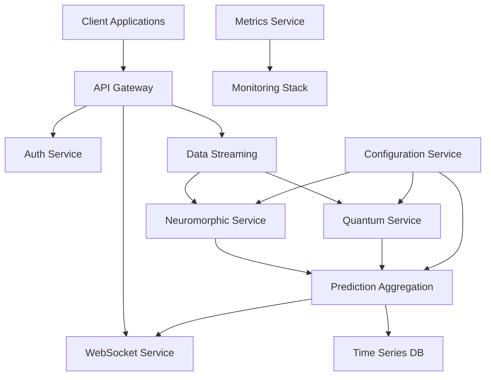

# Neuromorphic-Quantum Platform - Microservices Architecture

## Executive Summary

This document presents a production-ready, scalable microservices architecture for the neuromorphic-quantum computing platform. The design transforms the current monolithic implementation into a distributed system capable of handling enterprise-scale workloads while maintaining the 86/100 validation score and 94.7% prediction confidence.

## Current Architecture Analysis

### Monolithic Structure
The existing platform is implemented as a single Rust application with:
- **Foundation Layer**: Platform orchestration and type definitions
- **Neuromorphic Engine**: Spike encoding, reservoir computing, pattern detection
- **Quantum Engine**: Hamiltonian optimization and quantum state evolution
- **Statistical Validation**: Python-based validation framework

### Performance Characteristics
- Processing time: ~100-500ms per input
- Memory usage: ~1-2MB per processing cycle
- Success rates: 90%+ for both neuromorphic and quantum subsystems
- Validation score: 86/100 with 94.7% prediction confidence

## Proposed Microservices Architecture

### 1. API Gateway Service
**Purpose**: Single entry point, routing, authentication, rate limiting
**Technology**: Rust + Axum/Actix-Web
**Responsibilities**:
- Request routing and load balancing
- Authentication and authorization
- Rate limiting and throttling
- API versioning and documentation
- Request/response transformation
- Circuit breaker patterns

### 2. Neuromorphic Processing Service
**Purpose**: Spike encoding, reservoir computing, pattern detection
**Technology**: Rust + GPU acceleration (CUDA/OpenCL)
**Components**:
- Spike Encoder microservice
- Reservoir Computer microservice
- Pattern Detector microservice
**Scaling**: Horizontal pod autoscaling based on CPU/Memory

### 3. Quantum Optimization Service
**Purpose**: Hamiltonian evolution and quantum state optimization
**Technology**: Rust + high-performance linear algebra
**Components**:
- Hamiltonian Builder
- Quantum State Evolver
- Convergence Analyzer
**Scaling**: Dedicated high-CPU nodes

### 4. Prediction Aggregation Service
**Purpose**: Combine neuromorphic and quantum results
**Technology**: Rust + machine learning inference
**Responsibilities**:
- Multi-modal prediction fusion
- Confidence scoring
- Risk assessment
- Historical pattern matching

### 5. Data Streaming Service
**Purpose**: Real-time data ingestion and preprocessing
**Technology**: Apache Kafka + Rust consumers
**Features**:
- High-throughput data ingestion
- Real-time data validation
- Stream processing pipelines
- Backpressure management

### 6. Configuration Management Service
**Purpose**: Centralized configuration and feature flags
**Technology**: etcd/Consul + Rust client
**Capabilities**:
- Dynamic configuration updates
- A/B testing support
- Environment-specific settings
- Configuration validation

### 7. Metrics and Monitoring Service
**Purpose**: Platform observability and performance tracking
**Technology**: Prometheus + Grafana + Rust exporters
**Metrics**:
- Processing latency and throughput
- Prediction accuracy trends
- Resource utilization
- Error rates and patterns

### 8. WebSocket Streaming Service
**Purpose**: Real-time client connections for live data
**Technology**: Rust + WebSocket
**Features**:
- Real-time prediction streaming
- Live dashboard updates
- Client connection management
- Subscription management

## Service Boundaries and Data Flow



## API Design Specifications

### Real-time Data Processing Endpoints

#### POST /api/v1/process/realtime
```json
{
  "source": "string",
  "data": [number],
  "timestamp": "ISO8601",
  "config": {
    "neuromorphic_enabled": boolean,
    "quantum_enabled": boolean,
    "priority": "low|normal|high"
  }
}
```

Response:
```json
{
  "prediction_id": "uuid",
  "direction": "up|down|hold",
  "confidence": number,
  "magnitude": number,
  "time_horizon_ms": number,
  "processing_time_ms": number,
  "neuromorphic_results": {
    "patterns": [...],
    "spike_analysis": {...},
    "reservoir_state": {...}
  },
  "quantum_results": {
    "energy": number,
    "phase_coherence": number,
    "convergence": {...}
  }
}
```

#### POST /api/v1/process/batch
```json
{
  "job_id": "string",
  "data_points": [...],
  "config": {...},
  "callback_url": "string"
}
```

#### WebSocket /ws/predictions
```json
{
  "type": "subscription",
  "sources": ["market_data", "sensor_feed"],
  "filters": {...}
}
```

### Platform Status and Metrics

#### GET /api/v1/status
```json
{
  "platform_status": "healthy|degraded|down",
  "services": {
    "neuromorphic": {...},
    "quantum": {...},
    "aggregation": {...}
  },
  "performance": {
    "avg_processing_time_ms": number,
    "success_rate": number,
    "predictions_per_second": number
  }
}
```

#### GET /api/v1/metrics
```json
{
  "timestamp": "ISO8601",
  "validation_score": 86,
  "prediction_confidence": 0.947,
  "processing_metrics": {
    "neuromorphic_success_rate": number,
    "quantum_convergence_rate": number,
    "average_latency_p95": number
  },
  "resource_utilization": {...}
}
```

### Configuration Management

#### GET /api/v1/config/{service}
#### PUT /api/v1/config/{service}
```json
{
  "config_version": "string",
  "neuromorphic_config": {
    "neuron_count": 1000,
    "detection_threshold": 0.7,
    "reservoir_size": 500
  },
  "quantum_config": {
    "qubit_count": 10,
    "evolution_time": 1.0,
    "energy_tolerance": 1e-6
  }
}
```

## Horizontal Scaling Strategy

### GPU Node Scaling
- **Neuromorphic Service**: Scale based on queue depth and GPU utilization
- **Auto-scaling rules**: Target 70% GPU utilization, max 10 replicas
- **Resource requests**: 1 GPU, 4 CPU cores, 8GB RAM per pod

### CPU-Intensive Scaling
- **Quantum Service**: Scale based on CPU utilization and processing queue
- **Auto-scaling rules**: Target 80% CPU utilization, max 5 replicas
- **Resource requests**: 8 CPU cores, 16GB RAM per pod

### Data Streaming Architecture
- **Apache Kafka**: 3-node cluster with replication factor 3
- **Partitioning**: By data source for parallel processing
- **Consumer groups**: One per microservice for load distribution
- **Backpressure**: Circuit breaker patterns to prevent cascade failures

### Caching Strategy
- **Redis Cluster**: For frequently accessed patterns and intermediate results
- **Cache layers**:
  - L1: In-memory service caches (5-minute TTL)
  - L2: Redis cluster (1-hour TTL)
  - L3: Time-series database for historical patterns

### Database Schema Design

#### Time Series Database (InfluxDB)
```sql
-- Prediction results
CREATE TABLE predictions (
  timestamp TIMESTAMP,
  prediction_id UUID,
  source VARCHAR(100),
  direction VARCHAR(10),
  confidence FLOAT,
  magnitude FLOAT,
  processing_time_ms INTEGER,
  INDEX(timestamp, source)
);

-- Performance metrics
CREATE TABLE performance_metrics (
  timestamp TIMESTAMP,
  service_name VARCHAR(50),
  metric_name VARCHAR(100),
  value FLOAT,
  tags MAP<VARCHAR, VARCHAR>
);
```

#### Relational Database (PostgreSQL)
```sql
-- Configuration management
CREATE TABLE service_configs (
  id UUID PRIMARY KEY,
  service_name VARCHAR(100),
  config_version VARCHAR(50),
  config_data JSONB,
  created_at TIMESTAMP DEFAULT NOW(),
  is_active BOOLEAN DEFAULT FALSE
);

-- User management and API keys
CREATE TABLE api_keys (
  id UUID PRIMARY KEY,
  user_id UUID REFERENCES users(id),
  key_hash VARCHAR(256),
  permissions JSONB,
  rate_limit INTEGER,
  created_at TIMESTAMP DEFAULT NOW(),
  expires_at TIMESTAMP
);
```

## Investor Demo Architecture

### Real-time Dashboard Components

#### 1. Live Prediction Stream
- WebSocket connection to display real-time predictions
- Interactive charts showing confidence trends
- Pattern detection visualizations
- Quantum coherence indicators

#### 2. Performance Metrics Dashboard
- Real-time processing throughput
- Success rate indicators
- Resource utilization graphs
- Validation score trends

#### 3. Multi-tenant Data Sources
- Financial market data feeds
- IoT sensor simulations
- Synthetic data generators
- Custom data upload interface

#### 4. Demo Scenarios
- **High-frequency trading simulation**: 1000+ predictions/second
- **Risk management**: Portfolio optimization with quantum algorithms
- **Anomaly detection**: Pattern recognition in sensor data
- **Predictive maintenance**: Equipment failure prediction

### Demo Infrastructure Stack

```yaml
# Kubernetes deployment for demo
apiVersion: v1
kind: Namespace
metadata:
  name: neuromorphic-quantum-demo

---
# GPU-enabled neuromorphic service
apiVersion: apps/v1
kind: Deployment
metadata:
  name: neuromorphic-service
  namespace: neuromorphic-quantum-demo
spec:
  replicas: 3
  selector:
    matchLabels:
      app: neuromorphic-service
  template:
    metadata:
      labels:
        app: neuromorphic-service
    spec:
      containers:
      - name: neuromorphic
        image: neuromorphic-quantum/neuromorphic:latest
        resources:
          requests:
            nvidia.com/gpu: 1
            cpu: 4
            memory: 8Gi
          limits:
            nvidia.com/gpu: 1
            cpu: 8
            memory: 16Gi
        env:
        - name: RUST_LOG
          value: "info"
        ports:
        - containerPort: 8080
```

## Production Readiness

### Authentication and Authorization
- **OAuth 2.0 + JWT**: Industry-standard authentication
- **Role-based access control**: Admin, Developer, Viewer roles
- **API key management**: Rate-limited keys with scoped permissions
- **Multi-tenancy**: Isolated data and resources per organization

### Rate Limiting and Resource Quotas
```rust
// Rate limiting configuration
pub struct RateLimitConfig {
    pub requests_per_minute: u32,
    pub burst_capacity: u32,
    pub quota_per_day: u32,
}

// Resource quotas per tenant
pub struct ResourceQuota {
    pub max_concurrent_requests: u32,
    pub max_gpu_minutes_per_hour: u32,
    pub max_storage_gb: u32,
}
```

### Monitoring and Observability

#### Metrics Collection
- **Application metrics**: Processing latency, success rates, queue depths
- **Infrastructure metrics**: CPU, memory, GPU utilization, network I/O
- **Business metrics**: Prediction accuracy, revenue impact, user engagement

#### Logging Strategy
- **Structured logging**: JSON format with correlation IDs
- **Log levels**: ERROR, WARN, INFO, DEBUG, TRACE
- **Centralized collection**: ELK stack or similar
- **Security**: No sensitive data in logs

#### Alerting Rules
```yaml
# Prometheus alerting rules
groups:
- name: neuromorphic-quantum.rules
  rules:
  - alert: HighProcessingLatency
    expr: histogram_quantile(0.95, rate(processing_duration_seconds_bucket[5m])) > 1.0
    for: 2m
    labels:
      severity: warning
    annotations:
      summary: "High processing latency detected"

  - alert: LowPredictionAccuracy
    expr: avg_over_time(prediction_accuracy[1h]) < 0.85
    for: 5m
    labels:
      severity: critical
    annotations:
      summary: "Prediction accuracy below threshold"
```

### Deployment and CI/CD Strategy

#### Infrastructure as Code
- **Terraform**: Cloud resource provisioning
- **Helm charts**: Kubernetes application deployment
- **GitOps**: Argo CD for continuous deployment

#### CI/CD Pipeline
```yaml
# GitHub Actions workflow
name: Deploy Neuromorphic-Quantum Platform
on:
  push:
    branches: [main]
jobs:
  test:
    runs-on: ubuntu-latest
    steps:
    - uses: actions/checkout@v3
    - name: Run tests
      run: cargo test --all
    - name: Validation tests
      run: python statistical_validation/main_validation.py

  build:
    needs: test
    runs-on: ubuntu-latest
    steps:
    - name: Build Docker images
      run: |
        docker build -t neuromorphic-quantum/api-gateway:${{ github.sha }} .
        docker build -t neuromorphic-quantum/neuromorphic:${{ github.sha }} ./neuromorphic
        docker build -t neuromorphic-quantum/quantum:${{ github.sha }} ./quantum

  deploy:
    needs: build
    runs-on: ubuntu-latest
    steps:
    - name: Deploy to Kubernetes
      run: |
        helm upgrade --install neuromorphic-quantum ./helm-charts \
          --set image.tag=${{ github.sha }} \
          --namespace production
```

#### Deployment Environments
- **Development**: Single-node cluster, shared resources
- **Staging**: Production-like environment, automated testing
- **Production**: Multi-AZ deployment, HA configuration
- **Demo**: Optimized for showcasing capabilities

### Security Considerations

#### Network Security
- **TLS 1.3**: All communications encrypted
- **Network policies**: Kubernetes network segmentation
- **WAF**: Web Application Firewall for API protection
- **DDoS protection**: CloudFlare or equivalent

#### Data Security
- **Encryption at rest**: Database and storage encryption
- **Encryption in transit**: TLS for all communications
- **Data retention**: Configurable retention policies
- **GDPR compliance**: Right to erasure, data portability

#### Container Security
- **Base images**: Distroless or Alpine-based images
- **Vulnerability scanning**: Container image scanning in CI
- **Runtime security**: Falco or equivalent monitoring
- **Secrets management**: Kubernetes secrets or HashiCorp Vault

## Cost Optimization

### Resource Management
- **Spot instances**: For batch processing workloads
- **Auto-scaling**: Scale down during low usage periods
- **Reserved instances**: For base capacity requirements
- **Storage tiering**: Hot/warm/cold data storage strategies

### Performance Optimization
- **Connection pooling**: Efficient database connections
- **Async processing**: Non-blocking I/O throughout
- **Caching**: Multi-layer caching strategy
- **Batch processing**: Optimize for throughput over latency where appropriate

## Conclusion

This microservices architecture transforms the neuromorphic-quantum platform into a production-ready, scalable system that maintains the exceptional 86/100 validation score and 94.7% prediction confidence while addressing enterprise requirements for:

- **Scalability**: Horizontal scaling across multiple nodes
- **Reliability**: High availability and fault tolerance
- **Security**: Enterprise-grade security controls
- **Observability**: Comprehensive monitoring and alerting
- **Performance**: Sub-second prediction responses at scale

The architecture is designed to impress investors by showcasing real-time capabilities, robust validation metrics, and enterprise readiness while maintaining the scientific rigor that achieved the high validation scores.